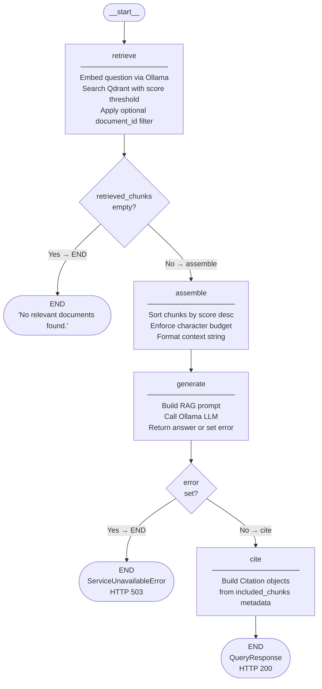

# RAG Graph Architecture

The RAG query pipeline is implemented as a compiled LangGraph `StateGraph` with four nodes and two conditional edges. This document describes the graph structure, node responsibilities, and state schema.

## Graph Diagram

## Node Descriptions

| Node | File | Responsibility |
|------|------|----------------|
| `retrieve` | `agents/nodes/retrieve.py` | Embeds the question via `OllamaEmbedder`, queries Qdrant with `score_threshold` and optional `document_id_filter`, returns `retrieved_chunks`. |
| `assemble` | `agents/nodes/assemble.py` | Sorts `retrieved_chunks` by score descending, greedily fills context up to `max_context_chars`, returns `context_string` and `included_chunks`. |
| `generate` | `agents/nodes/generate.py` | Builds the RAG prompt from context and question, calls `ollama.Client.chat()`, returns `answer`. On connectivity failure sets `error = "service_unavailable"`. |
| `cite` | `agents/nodes/cite.py` | Builds `Citation` objects from `included_chunks` metadata (filename, page_number, chunk_index, relevance_score). |

## Conditional Edges

### After `retrieve`

| Condition | Destination | Effect |
|-----------|-------------|--------|
| `retrieved_chunks` is empty | `END` | `QueryService` returns `"No relevant documents found."` with `HTTP 200`. The `assemble` and `generate` nodes are never called. |
| `retrieved_chunks` is non-empty | `assemble` | Normal happy path continues. |

### After `generate`

| Condition | Destination | Effect |
|-----------|-------------|--------|
| `error == "service_unavailable"` | `END` | `QueryService` raises `ServiceUnavailableError` → `HTTP 503`. |
| No error | `cite` | Normal happy path — citation objects are built and returned. |

## State Schema (`RAGState`)

All fields are optional (`TypedDict(total=False)`). Each node sets only the fields it produces.

| Field | Type | Set by | Description |
|-------|------|--------|-------------|
| `question` | `str` | QueryService | User's question string |
| `top_k` | `int` | QueryService | Maximum chunks to retrieve |
| `score_threshold` | `float` | QueryService | Minimum cosine similarity score |
| `document_id` | `str \| None` | QueryService | Optional document filter |
| `request_id` | `str` | QueryService | Correlation ID for log tracing |
| `start_time` | `float` | QueryService | `time.monotonic()` at query start |
| `retrieved_chunks` | `list[RetrievedChunk]` | `retrieve` | All chunks above threshold |
| `context_string` | `str` | `assemble` | Formatted context for LLM prompt |
| `included_chunks` | `list[RetrievedChunk]` | `assemble` | Chunks that fit within char budget |
| `answer` | `str` | `generate` | LLM-generated answer (on success) |
| `error` | `str \| None` | `generate` | Error code string (on failure) |
| `citations` | `list[Citation]` | `cite` | Citation objects from included chunks |

## Design Decisions

**Node factories (closure pattern):** Each node is built via `build_<name>_node(deps...)`, which returns a `(state: RAGState) -> dict` function. Dependencies (embedder, LLM client, etc.) are injected at build time, captured in closures. This makes nodes pure functions of state at call time, independently unit-testable without patching module-level imports.

**Partial state updates:** Nodes return only the fields they set. LangGraph merges partial updates into the accumulated state using last-write-wins. This is why `RAGState` uses `total=False`.

**Graph compiled once at startup:** `build_rag_graph()` is called in the FastAPI lifespan and the compiled graph is stored on `app.state.rag_graph`. `QueryService` receives it via the `get_query_service` dependency, which reads `request.app.state.rag_graph`. The graph is reused across all requests.

**Error as state, not exception:** The `generate` node catches Ollama connectivity errors and sets `state["error"] = "service_unavailable"` rather than raising. This keeps error propagation explicit and visible in the graph state. `QueryService` converts the error code to `ServiceUnavailableError` → HTTP 503 after `graph.invoke()` returns.

**`latency_ms` measured in QueryService:** Timing wraps the entire `graph.invoke()` call in `QueryService._query_sync` rather than inside a node. This captures graph dispatch overhead and gives an accurate end-to-end latency figure.
